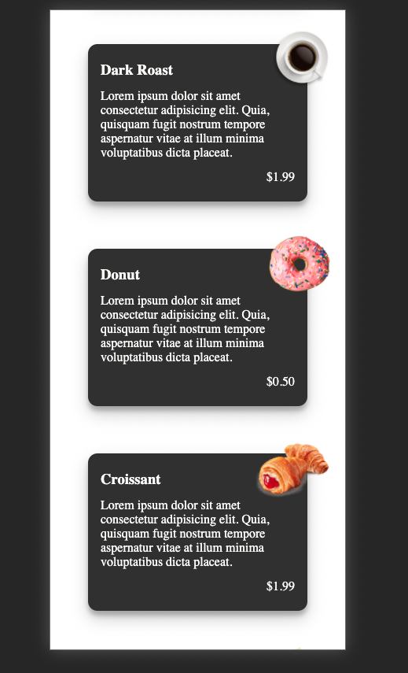

# Crescent Moon Cafe 
🎨 This repository is for new developers. I have created this site to show what you can do with HTML, CSS and Javascript. 

You can route between pages, use css to apply amazing styles and javaScript to show functionality with the menu by allowing clients to filter between the type of food and drinks they are searching through. 

## Tech stack: 
- HTML 
- CSS ( Flex box and Css Grid)
- Javascript

## Status
- 
In progress 💻

## Current progress images: 

<video src="./video/filter.preview.mov" width="640" height="264" ></video>

